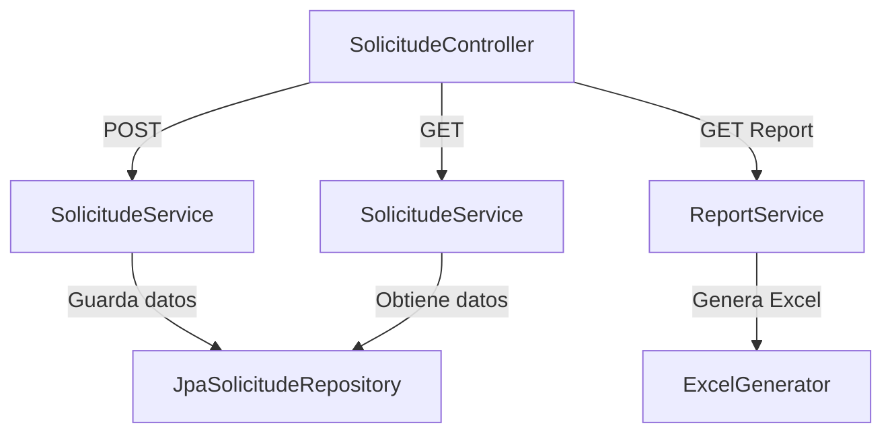

# Prueba Técnica - API REST

Este proyecto es una API REST diseñada siguiendo principios de **arquitectura limpia** y los principios **SOLID**. Está desarrollado con **Java** y **Spring Boot**, e incluye funcionalidades como gestión de solicitudes y generación de reportes en formato Excel.

## Contenido
- [Estructura del Proyecto](#estructura-del-proyecto)
- [Tecnologías Utilizadas](#tecnologías-utilizadas)
- [Requisitos Previos](#requisitos-previos)
- [Instrucciones para Ejecutar el Proyecto](#instrucciones-para-ejecutar-el-proyecto)
- [Especificaciones Técnicas](#especificaciones-técnicas)
- [Diagrama de Flujo](#diagrama-de-flujo)

## Estructura del Proyecto
El proyecto está estructurado de la siguiente manera:

```plaintext
src/main/java/com/example/prueba_tecnica/
├── application/               # Capa de aplicación (Casos de uso / lógica de negocio)
│       ├── services/
│       │       ├── SolicitudService.java
│       │       ├── ReportService.java
│
├── domain/                    # Capa del dominio (Modelos, repositorios y DTOs)
│       ├── entities/
│       │       ├── Solicitud.java
│       │
│       ├── repositories/
│       │       ├── SolicitudRepository.java
│       │
│       ├── dtos/
│               ├── SolicitudRequest.java
│               ├── SolicitudResponse.java
│               ├── ProcessResponse.java
│
├── infrastructure/            # Capa de infraestructura (Controladores, persistencia, adaptadores externos)
│       ├── controllers/       # Controladores que exponen la API REST
│       │       ├── SolicitudController.java
│       │       ├── ReportController.java
│       │
│       ├── persistence/       # Persistencia y acceso a datos
│       │       ├── JpaSolicitudRepository.java
│       │
│       ├── excel/             # Adaptadores externos (e.g., generación de reportes)
│       │       ├── ExcelGenerator.java
│       │
│       ├── config/            # Configuración (e.g., Swagger, seguridad, etc.)
│               ├── SwaggerConfig.java
│
├── utils/                     # Utilidades y funciones auxiliares
│       ├── FileValidator.java
│
└── PruebaTecnicaApplication.java # Clase principal de la aplicación
```

## Tecnologías Utilizadas
- **Java 17**
- **Spring Boot 3.x**
- **Apache POI** (para generación de archivos Excel)
- **H2 Database** (base de datos en memoria para desarrollo y pruebas)
- **Swagger** (documentación de API)

## Requisitos Previos
1. Tener instalado **Java 17** o superior.
2. Tener instalado **Maven**.
3. Clonar el repositorio desde GitHub:
   ```bash
   git clone <URL_DEL_REPOSITORIO>
   cd <NOMBRE_DEL_PROYECTO>
   ```

## Instrucciones para Ejecutar el Proyecto

### 1. Configurar el entorno
- Modifica el archivo `application.properties` para establecer configuraciones personalizadas si es necesario (como el puerto o la base de datos).

### 2. Construir y ejecutar el proyecto
Ejecuta los siguientes comandos:
```bash
mvn clean install
mvn spring-boot:run
```

### 3. Acceder a la API
- La API estará disponible en: `http://localhost:8080`
- La documentación de Swagger estará en: `http://localhost:8080/swagger-ui.html`

### 4. Probar la API
Puedes usar herramientas como **Postman** o **cURL** para interactuar con los endpoints.

## Especificaciones Técnicas

### Endpoints Principales
#### Solicitudes
- **GET** `/api/solicitudes`: Obtiene todas las solicitudes.
- **POST** `/api/solicitudes`: Registra una nueva solicitud.
- **PUT** `/api/solicitudes/{id}`: Actualiza el estado de una solicitud.
- **DELETE** `/api/solicitudes/{id}`: Elimina una solicitud.

#### Reportes
- **GET** `/api/reportes`: Genera y descarga un archivo Excel con todas las solicitudes.

### Validaciones
- Archivos subidos deben ser **PDF** y no exceder los **5MB** (validado por `FileValidator`).
- Las solicitudes incluyen campos obligatorios como `nombreCompleto`, `identificacion`, `correoElectronico`, etc.

### Arquitectura
La API sigue la **arquitectura limpia**, con las siguientes capas:
- **Domain**: Contiene las entidades, repositorios y DTOs.
- **Application**: Contiene la lógica de negocio y los casos de uso (servicios).
- **Infrastructure**: Contiene los controladores, adaptadores externos y configuraciones.
- **Utils**: Contiene utilidades y validadores comunes.

### Persistencia
- Implementación de acceso a datos con JPA y un repositorio H2 en memoria para pruebas.
- El repositorio JPA (`JpaSolicitudeRepository`) está encapsulado en la capa de infraestructura.

## Diagrama de Flujo



## Contribuciones
Si deseas contribuir, realiza un fork del proyecto, crea una rama con tus cambios y abre un Pull Request.

## Licencia
Este proyecto está licenciado bajo [MIT License](LICENSE).

